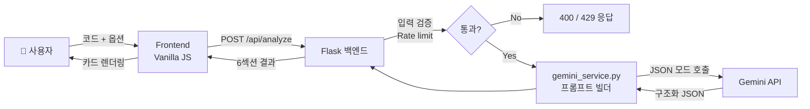

<div align="center">

# 🤖 CodeMentor AI

### Gemini 기반 AI 코드 리뷰 · 버그 수정 · 리팩토링 · 성능 개선 웹 서비스

코드를 입력하면 AI가 **6가지 관점**으로 분석하고 수정된 코드까지 제안합니다.


[데모](#-화면-예시) · [실행 방법](#-실행-방법) · [API](#-api-스펙) · [구현 회고](#-구현-과정에서-배운-점)

</div>

---

## 📚 목차

1. [📖 프로젝트 소개](#-프로젝트-소개)
2. [🎯 개발 목적](#-개발-목적)
3. [✨ 주요 기능](#-주요-기능)
4. [🛠 기술 스택](#-기술-스택)
5. [🏗 아키텍처](#-아키텍처)
6. [📁 프로젝트 구조](#-프로젝트-구조)
7. [📸 화면 예시](#-화면-예시)
8. [🚀 실행 방법](#-실행-방법)
9. [🔑 환경변수 설정](#-환경변수-설정)
10. [🔌 API 스펙](#-api-스펙)
11. [🛡 보안 & Rate Limit](#-보안--rate-limit)
12. [🌐 배포 (Render)](#-배포-render)
13. [💡 구현 과정에서 배운 점](#-구현-과정에서-배운-점)
14. [🚧 향후 개선 사항](#-향후-개선-사항)
15. [📝 포트폴리오 설명 문장](#-포트폴리오-설명-문장)
16. [📜 라이선스](#-라이선스)

---

## 📖 프로젝트 소개

**CodeMentor AI** 는 Google Gemini API 를 활용해 Java · Python · JavaScript 코드를 자동 분석하는 **풀스택 AI 코드 리뷰 웹 서비스**입니다.

사용자는 분석할 코드와 모드(코드 리뷰 / 버그 수정 / 리팩토링 / 성능 개선)를 선택하기만 하면 되고, AI는 6가지 관점으로 구조화된 결과를 반환합니다:

> 📋 코드 요약 · 🚨 발견된 문제점 · 💡 개선 제안 · ✨ 수정된 코드 · ⚡ 성능 분석(Big-O Before→After) · 🎓 추가 학습 포인트

VS Code 풍의 다크 테마 UI 위에서 결과가 카드 형태로 정리되어, 코드 리뷰 결과를 한 화면에서 직관적으로 확인할 수 있습니다.

---

## 🎯 개발 목적

> "AI API 호출 한 줄"이 아니라 **실서비스에 가까운 구조**를 만들어보고 싶었습니다.

| 목적 | 학습 / 실험 포인트 |
|---|---|
| **AI 실용화** | 단순 챗봇 래퍼가 아닌, 구조화된 결과를 반환하는 도구로서의 LLM 활용 |
| **프롬프트 엔지니어링** | JSON 스키마 강제, 분석 유형별 instruction tuning, 응답 안정성 확보 |
| **풀스택 1인 완주** | 설계 → 백엔드 API → 프론트 UX → 보안 → 배포 → 문서화까지 직접 |
| **배포 대비 보안** | API 키 격리, Rate limit, CORS 화이트리스트, 보안 헤더, 에러 새니타이즈 |
| **UX 완성도** | 빈/로딩/에러/결과 4가지 상태, 글자 수 카운터, 인라인 경고, 단축키 |

---

## ✨ 주요 기능

### 🔍 분석 기능
- **3개 언어 지원** — Java, Python, JavaScript
- **4가지 분석 모드**
  - 📋 **코드 리뷰** — 가독성·구조·네이밍 전반 검토
  - 🐛 **버그 수정** — 버그 탐지 + 수정된 코드 제공
  - 🔧 **리팩토링** — 동작 유지하며 구조 개선
  - ⚡ **성능 개선** — 시간/공간 복잡도 최적화
- **6섹션 구조화 응답** — 요약 / 문제점 / 개선 / 수정 코드 / 성능 / 학습 포인트
- **심각도 분류** — `high` · `medium` · `low` · `info` 4단계, 좌측 컬러 보더로 시각화
- **Big-O 비교** — Before → After 복잡도를 카드로 시각화

### 🎨 UX
- **개발자 도구 풍 다크 테마** — macOS 창 스타일(트래픽 라이트), VS Code 영감 색상
- **반응형 레이아웃** — 1024px 이상 2-pane, 미만은 stack
- **예제 코드 자동 삽입** — 언어별 데모 코드 1-클릭 삽입 (분석기 능력 즉시 체감)
- **실시간 글자 수 카운터** — 80% 도달 시 🟡, 한도 초과 시 🔴 + 분석 버튼 자동 비활성화
- **인라인 경고 바** — 빈 입력/한도 초과를 토스트 스타일로 표시 (결과 영역 안 가림)
- **`Ctrl+Enter` 단축키** — 빠른 분석 실행
- **결과 카드별 애니메이션** — `fadeUp` 으로 부드러운 등장
- **수정 코드 복사 버튼** — 클릭 시 "복사됨!" 피드백
- **Prism.js 구문 하이라이팅** — 수정된 코드 가독성 향상

### 🛡 운영
- **Rate limit** — IP당 분당 5회, 시간당 30회 (`.env` 로 조정 가능)
- **API Key 백엔드 격리** — 프론트에 절대 노출되지 않음
- **CORS 화이트리스트** — 배포 시 도메인 제한 가능
- **에러 새니타이즈** — 사용자 메시지와 서버 로그 분리

---

## 🛠 기술 스택

<table>
<tr>
<td valign="top" width="50%">

### Frontend
| 기술 | 용도 |
|---|---|
| **HTML5** | 시맨틱 마크업 |
| **CSS3** | CSS Variables, Grid, Flexbox, 다크 테마 |
| **Vanilla JavaScript** | DOM 조작, fetch API |
| **Prism.js** | 코드 구문 하이라이팅 |

</td>
<td valign="top" width="50%">

### Backend
| 기술 | 용도 |
|---|---|
| **Python 3.10+** | 런타임 |
| **Flask 3.x** | 웹 프레임워크 |
| **Flask-CORS** | CORS 화이트리스트 |
| **Flask-Limiter** | IP 기반 rate limit |
| **python-dotenv** | `.env` 환경변수 |
| **google-genai** | Gemini API SDK |

</td>
</tr>
</table>

### Infrastructure / Tooling
`Google Gemini 2.5 Flash` · `VSCode` · `Git` · `Render` (배포 예정)

---

## 🏗 아키텍처



### 레이어 책임
| 레이어 | 책임 | 의존성 |
|---|---|---|
| `app.py` | HTTP 라우팅, 입력 검증, rate limit, 보안 헤더, 에러 핸들링 | Flask 만 알고 Gemini 는 모름 |
| `gemini_service.py` | 프롬프트 조립, Gemini SDK 호출, JSON 파싱, 에러 래핑 | Gemini SDK 만 알고 Flask 는 모름 |
| `frontend/` | UI 렌더링, 상태 관리, fetch | 백엔드 API 만 알고 Gemini 는 모름 |

→ 각 레이어가 독립적이므로 **단위 테스트 시 Gemini SDK 를 쉽게 모킹**할 수 있습니다.

---

## 📁 프로젝트 구조

```
CodeMentor AI/
├── backend/
│   ├── app.py                  # Flask 엔트리포인트, 라우팅, 보안
│   ├── gemini_service.py       # Gemini API 래퍼 + 프롬프트 빌더
│   ├── requirements.txt        # flask, flask-cors, flask-limiter, dotenv, google-genai, gunicorn
│   ├── .env.example            # 환경변수 템플릿
│   ├── templates/
│   │   └── index.html          # 단일 페이지 (입력 / 결과 2-pane)
│   └── static/
│       ├── css/style.css       # 다크 테마, 반응형, 카드 스타일
│       └── js/main.js          # fetch 호출, 6섹션 렌더링, 상태 관리
├── docs/
│   └── screenshots/            # README용 스크린샷
├── .vscode/
│   └── launch.json             # F5 한 번에 실행
├── Procfile                    # 배포용 gunicorn 시작 명령
├── render.yaml                 # Render IaC 설정 (선택)
├── .gitignore                  # 보안 강화 (시크릿/인증서 광범위 차단)
└── README.md
```

---

## 📸 화면 예시

> 📌 스크린샷은 `docs/screenshots/` 폴더에 추가합니다.

### 메인 화면 — 좌: 코드 입력, 우: 분석 결과


### 분석 결과 — 6섹션 카드 (요약 · 문제점 · 개선 · 수정 코드 · 성능 · 학습)


### 성능 분석 카드 — Big-O Before → After 비교


### 반응형 — 모바일에서 세로 stack


<details>
<summary>📹 데모 GIF (클릭하여 펼치기)</summary>


</details>

---

## 🚀 실행 방법

> 처음부터 따라하면 약 5분 안에 로컬에서 동작합니다.

### 0. 사전 준비

| 항목 | 확인 방법 / 설치 |
|---|---|
| **Python 3.10+** | 터미널에 `python --version` 입력 → 3.10 이상이면 OK. 없으면 [python.org](https://www.python.org/downloads/) 에서 설치 (설치 시 **"Add Python to PATH" 체크 필수**) |
| **Git** | `git --version` 확인. 없으면 [git-scm.com](https://git-scm.com/downloads) |
| **Gemini API 키** (무료) | [aistudio.google.com/apikey](https://aistudio.google.com/apikey) → `Create API key` → 발급된 키 복사 (한 번만 보임) |
| (권장) **VSCode** | [code.visualstudio.com](https://code.visualstudio.com) + "Python" 확장 (Microsoft) 설치 |

### 1. 저장소 클론

```bash
git clone https://github.com/<your-username>/codementor-ai.git
cd codementor-ai
```
> 클론 폴더명은 GitHub 저장소 이름과 동일합니다. 위 예시는 `codementor-ai` 라고 가정.

### 2. 가상환경 생성 + 의존성 설치

<details open>
<summary><b>🪟 Windows (PowerShell)</b></summary>

```powershell
cd backend
python -m venv .venv
.\.venv\Scripts\Activate.ps1
pip install -r requirements.txt
```

> ❗ **`...Activate.ps1 cannot be loaded because running scripts is disabled` 에러가 나면**
> 처음 한 번만 다음 명령으로 정책을 풀어주세요:
> ```powershell
> Set-ExecutionPolicy -Scope CurrentUser RemoteSigned
> ```
> 그 후 다시 `Activate.ps1` 실행.

</details>

<details>
<summary><b>🍎 macOS / 🐧 Linux</b></summary>

```bash
cd backend
python3 -m venv .venv
source .venv/bin/activate
pip install -r requirements.txt
```

</details>

✅ 정상 활성화되면 프롬프트 앞에 **`(.venv)`** 표시가 나타납니다. 안 보이면 venv 활성화 실패 — 위 명령을 다시 확인하세요.

### 3. `.env` 파일 생성 (API 키 등록)

`backend/` 폴더에서:

```bash
# Windows PowerShell
copy .env.example .env

# macOS / Linux
cp .env.example .env
```

생성된 `.env` 파일을 열어 첫 줄의 `GEMINI_API_KEY` 에 0번 단계에서 발급받은 키를 붙여넣기:

```env
GEMINI_API_KEY=AIzaSy...여기에_본인_키
```
나머지 값은 모두 기본값으로 두셔도 됩니다. (각 변수 자세한 설명은 [환경변수 설정](#-환경변수-설정) 참조)

### 4. 서버 실행

**옵션 A — VSCode (가장 간단)**
프로젝트 루트를 VSCode 로 열고 `F5` (또는 좌측 ▶️ `Run and Debug` → `Run CodeMentor AI (Flask)`)

**옵션 B — 터미널** (가상환경 활성화 `(.venv)` 상태에서)
```bash
python app.py
```

다음 메시지가 보이면 성공:
```
 * Running on http://0.0.0.0:5000
 * Press CTRL+C to quit
```

### 5. 동작 확인

| 확인 | 방법 |
|---|---|
| 헬스체크 | <http://localhost:5000/api/health> → `{"status":"ok"}` |
| 메인 화면 | <http://localhost:5000> → 다크 테마 UI 로딩 |
| **데모 1-클릭** | 우측 상단 `📝 Python 예제` → 분석 유형 `⚡ 성능 개선` → **분석하기** 클릭 → 6개 결과 카드 확인 |
| 단축키 | 코드 입력 후 `Ctrl + Enter` |

### 종료
터미널에서 `Ctrl + C`

---

### 🔁 두 번째 실행부터

이미 설치된 뒤에는 **venv 재활성화 + 실행** 두 줄만 입력하면 됩니다.

<details>
<summary><b>🪟 Windows</b></summary>

```powershell
cd codementor-ai\backend
.\.venv\Scripts\Activate.ps1
python app.py
```

</details>

<details>
<summary><b>🍎 macOS / 🐧 Linux</b></summary>

```bash
cd codementor-ai/backend
source .venv/bin/activate
python app.py
```

</details>

---

### ❓ 자주 발생하는 오류와 해결

<details>
<summary><b><code>ModuleNotFoundError: No module named 'flask'</code> (또는 다른 패키지)</b></summary>

**원인**: 가상환경이 활성화되지 않은 채로 실행 중
**해결**: 프롬프트 앞에 `(.venv)` 가 있는지 확인. 없으면 활성화 명령 다시 실행 후 `python app.py`. 가상환경 안에서 `pip install -r requirements.txt` 도 다시 한 번 시도해보세요.

</details>

<details>
<summary><b><code>Address already in use</code> / <code>port 5000 is in use</code></b></summary>

**원인**: 다른 프로그램이 5000 포트를 사용 중 (macOS 의 AirPlay 가 흔한 범인)
**해결**:
- `backend/.env` 에서 `PORT=5001` 로 변경 후 재실행, 또는
- macOS: 시스템 환경설정 → 공유 → "AirPlay 수신기" 끄기

</details>

<details>
<summary><b>화면은 뜨는데 분석 시 "AI 서비스가 설정되지 않았습니다"</b></summary>

**원인**: `.env` 의 `GEMINI_API_KEY` 비어있거나 키가 잘못됨
**해결**: [AI Studio](https://aistudio.google.com/apikey) 에서 키 재발급 → `.env` 에 붙여넣기 → 저장 → 서버 재시작 (`Ctrl+C` → `python app.py`)

</details>

<details>
<summary><b>코드를 수정했는데 새로고침해도 반영 안 됨</b></summary>

**원인**: `FLASK_DEBUG` 가 꺼져있거나 static/template 파일 수정
**해결**:
- 백엔드 코드(`.py`) 수정 → `.env` 에 `FLASK_DEBUG=1` 이면 자동 리로드
- 프론트(`.html`/`.css`/`.js`) 수정 → 브라우저에서 `Ctrl + Shift + R` (강력 새로고침)

</details>

<details>
<summary><b><code>Activate.ps1 cannot be loaded</code> (Windows)</b></summary>

**원인**: PowerShell 실행 정책이 `Restricted`
**해결**: 한 번만 정책을 변경하면 됩니다:
```powershell
Set-ExecutionPolicy -Scope CurrentUser RemoteSigned
```
그 후 `Y` 입력 → 다시 `.\.venv\Scripts\Activate.ps1` 실행.

</details>

---

## 🔑 환경변수 설정

> 실제 설정 단계는 [실행 방법 #3](#-실행-방법) 에 통합되어 있습니다.
> 이 섹션은 **각 변수의 의미와 보안 가이드** 를 모은 레퍼런스입니다.

### Gemini API 키 발급

1. [**Google AI Studio**](https://aistudio.google.com/apikey) 에 Google 계정으로 로그인
2. `Create API key` 클릭 → 프로젝트 선택 (없으면 자동 생성)
3. 발급된 키 복사 (**한 번만 보이므로 안전한 곳에 보관**)
4. `backend/.env` 의 `GEMINI_API_KEY=` 뒤에 붙여넣기

> ⚠️ **API 키 보안 주의**
> - `.env` 는 절대 Git 에 커밋하지 마세요 (`.gitignore` 에 등록되어 있음)
> - 실수로 푸시했다면 **즉시 Google AI Studio 에서 revoke** 후 새 키 발급
> - 키를 코드/이슈/스크린샷/Slack 에 붙이지 마세요

### 환경변수 전체 목록

| 변수 | 필수 | 기본값 | 설명 |
|---|---|---|---|
| `GEMINI_API_KEY` | ✅ | — | Google AI Studio 발급 키 |
| `GEMINI_MODEL` | | `gemini-2.5-flash` | 모델명. 정확도 필요시 `gemini-2.5-pro` |
| `PORT` | | `5000` | Flask 포트 |
| `FLASK_DEBUG` | | `1` | 디버그. **배포는 `0`** |
| `MAX_CODE_LENGTH` | | `20000` | 코드 최대 글자 수 |
| `RATE_LIMIT` | | `5 per minute;30 per hour` | IP당 분석 횟수 제한 |
| `ALLOWED_ORIGINS` | | `*` | CORS 허용 출처 (쉼표 구분) |

---

## 🔌 API 스펙

### `POST /api/analyze` — 코드 분석
```json
{
  "code": "def add(a, b):\n    return a + b",
  "language": "python",
  "analysis_type": "code_review"
}
```

**응답 (200)**
```json
{
  "summary": "두 정수를 더해 반환하는 함수입니다...",
  "problems":        [{ "title": "...", "severity": "low", "description": "...", "line": "1" }],
  "improvements":    [{ "title": "...", "description": "...", "line": "1" }],
  "fixed_code":      "def add(a: int, b: int) -> int:\n    return a + b",
  "performance":     { "before": "O(1)", "after": "O(1)", "explanation": "..." },
  "learning_points": [{ "title": "...", "description": "..." }],
  "language": "python",
  "analysis_type": "code_review",
  "model": "gemini-2.5-flash"
}
```

| HTTP | 의미 |
|---|---|
| 200 | 성공 |
| 400 | 입력 검증 실패 (빈 코드 / 한도 초과 / 잘못된 enum) |
| 429 | Rate limit 초과 |
| 502 | Gemini API 호출 실패 |
| 500 | 기타 서버 오류 |

### 기타 엔드포인트
| Method | Path | 설명 |
|---|---|---|
| `GET` | `/api/health` | 헬스체크 |
| `GET` | `/api/config` | 한도·지원 언어·분석 유형 메타 (프론트 동기화용) |

---

## 🛡 보안 & Rate Limit

| 계층 | 적용 내용 |
|---|---|
| **API Key 격리** | 서버 환경변수로만 사용. 프론트/응답/네트워크 탭에 절대 노출 안 됨 |
| **입력 검증** | 코드 길이 · 언어 · 분석 유형 화이트리스트, 빈 입력 400 거부 |
| **Rate Limit** | Flask-Limiter 로 IP당 분당 5/시간당 30회 (env 조정). 429 시 친화적 메시지 |
| **CORS 화이트리스트** | `ALLOWED_ORIGINS` env 로 배포 시 도메인 제한 |
| **보안 헤더** | `X-Content-Type-Options`, `X-Frame-Options`, `Referrer-Policy`, `Permissions-Policy` |
| **에러 새니타이즈** | 사용자엔 정적 메시지, 서버 로그엔 전체 스택트레이스 (`exc_info=True`) |
| **`.gitignore` 강화** | `.env*` 전부, 인증서, GCP/Firebase 키 패턴 광범위 차단 |

---

## 🌐 배포 (Render)

Flask 백엔드 + 프론트엔드(static/templates) 를 **단일 서비스**로 배포합니다.
프론트가 같은 origin 에서 서빙되므로 CORS 이슈 없이 동작합니다.

### 사전 준비

| 항목 | 비고 |
|---|---|
| GitHub 저장소 | 코드를 push 해 두기 (`render.yaml` · `Procfile` · `backend/` 포함) |
| Render 계정 | [render.com](https://render.com) 가입 (무료) |
| Gemini API 키 | [aistudio.google.com/apikey](https://aistudio.google.com/apikey) 에서 발급 |

### 📦 배포 구성 파일

레포에 이미 포함되어 있습니다:

<details>
<summary><b><code>Procfile</code></b> — 단순 대시보드 배포용</summary>

```procfile
web: gunicorn --chdir backend --bind 0.0.0.0:$PORT --workers 2 --timeout 120 app:app
```
- `--chdir backend` : 레포 root 에서도 backend 폴더로 진입
- `--workers 2` : Render 무료 플랜에서 적절한 워커 수
- `--timeout 120` : Gemini 호출이 30s 를 넘을 수 있으므로 기본 30s → 120s
- `app:app` : `app.py` 의 Flask 인스턴스 `app`

</details>

<details>
<summary><b><code>render.yaml</code></b> — IaC (Blueprint) 배포용</summary>

```yaml
services:
  - type: web
    name: codementor-ai
    runtime: python
    rootDir: backend
    plan: free
    buildCommand: pip install -r requirements.txt
    startCommand: gunicorn --bind 0.0.0.0:$PORT --workers 2 --timeout 120 app:app
    healthCheckPath: /api/health
    envVars:
      - key: GEMINI_API_KEY
        sync: false                # secret — 대시보드에서 직접 입력
      - key: FLASK_DEBUG
        value: "0"
      # ... 나머지는 render.yaml 참고
```

</details>

### 🚀 방법 1: 대시보드 수동 배포 (가장 쉬움)

1. [Render Dashboard](https://dashboard.render.com) → **New +** → **Web Service**
2. GitHub 저장소 연결 → `CodeMentor AI` 선택
3. 다음 값으로 설정:

| 항목 | 값 |
|---|---|
| **Name** | `codementor-ai` (원하는 이름) |
| **Region** | `Singapore` (한국에서 가장 가까움) |
| **Branch** | `main` |
| **Root Directory** | `backend` |
| **Runtime** | `Python 3` |
| **Build Command** | `pip install -r requirements.txt` |
| **Start Command** | `gunicorn --bind 0.0.0.0:$PORT --workers 2 --timeout 120 app:app` |
| **Plan** | `Free` |

4. 하단 **Advanced** → **Environment Variables** 추가:

| Key | Value |
|---|---|
| `GEMINI_API_KEY` | `AIzaSy...` 🔐 **Secret** |
| `GEMINI_MODEL` | `gemini-2.5-flash` |
| `FLASK_DEBUG` | `0` |
| `MAX_CODE_LENGTH` | `20000` |
| `RATE_LIMIT` | `5 per minute;30 per hour` |
| `ALLOWED_ORIGINS` | `https://<your-service>.onrender.com` |
| `PYTHON_VERSION` | `3.11.0` |

5. **Create Web Service** → 자동 빌드 → 배포 완료까지 3~5분
6. 발급된 URL (`https://codementor-ai.onrender.com`) 접속 → 동작 확인

### ⚙️ 방법 2: render.yaml Blueprint (자동화)

1. Render Dashboard → **New +** → **Blueprint**
2. GitHub 저장소 선택 → `render.yaml` 자동 감지
3. `GEMINI_API_KEY` 값만 입력 (나머지는 yaml 에서 자동 적용)
4. **Apply** → 끝

### ✅ 배포 후 확인 체크리스트

```bash
# 헬스체크
curl https://<your-service>.onrender.com/api/health
# → {"status":"ok"}

# 설정 확인
curl https://<your-service>.onrender.com/api/config
# → {"max_code_length":20000,...}

# 실제 분석
curl -X POST https://<your-service>.onrender.com/api/analyze \
  -H "Content-Type: application/json" \
  -d '{"code":"def add(a,b): return a+b","language":"python","analysis_type":"code_review"}'
```

### 🔥 자주 발생하는 오류와 해결

<details>
<summary><b>1. <code>ModuleNotFoundError: No module named 'flask_limiter'</code></b></summary>

**원인**: `requirements.txt` 가 backend 폴더에 있는데 Root Directory 설정을 안 함
**해결**: Render 설정의 Root Directory 가 `backend` 인지 확인. Procfile 사용 시 `--chdir backend` 가 포함되어 있는지.

</details>

<details>
<summary><b>2. <code>gunicorn: command not found</code></b></summary>

**원인**: `requirements.txt` 에 `gunicorn` 누락
**해결**: `backend/requirements.txt` 마지막 줄에 `gunicorn>=21.2.0` 추가 후 재배포.

</details>

<details>
<summary><b>3. <code>Application failed to bind to $PORT</code> / 빌드는 성공인데 502</b></summary>

**원인**: gunicorn 이 Render 가 지정한 `$PORT` 에 바인딩하지 않음
**해결**: Start Command 에 `--bind 0.0.0.0:$PORT` 가 포함되어 있는지 확인.
```
gunicorn --bind 0.0.0.0:$PORT --workers 2 --timeout 120 app:app
```

</details>

<details>
<summary><b>4. 분석 요청이 30초 후 타임아웃</b></summary>

**원인**: Gemini 응답이 30s 를 넘기는데 gunicorn 기본 timeout 이 30s
**해결**: Start Command 에 `--timeout 120` 추가. 위 명령에 이미 포함되어 있음.

</details>

<details>
<summary><b>5. <code>AI 서비스가 설정되지 않았습니다</code> 오류</b></summary>

**원인**: `GEMINI_API_KEY` 환경변수가 Render 에 등록되지 않음
**해결**: Render Dashboard → 서비스 → **Environment** 탭 → `GEMINI_API_KEY` 추가 후 **Save Changes** → 자동 재배포 대기.

</details>

<details>
<summary><b>6. CSS / JS 가 적용되지 않음 (404)</b></summary>

**원인**: 표준 Flask `templates/` + `static/` 구조가 아님, 또는 HTML 에 절대경로 `/assets/...` 사용
**해결**: HTML 에서 `{{ url_for('static', filename='css/style.css') }}` 형식 사용 확인. 본 프로젝트는 이미 적용됨.

</details>

<details>
<summary><b>7. 첫 요청이 매우 느림 (~30초)</b></summary>

**원인**: Render Free 플랜은 15분 무활동 시 인스턴스를 **spin down** 함. 다음 요청이 cold start 를 트리거.
**해결**:
- (저비용) [UptimeRobot](https://uptimerobot.com) 등으로 `/api/health` 를 10분마다 핑
- (유료) Starter 플랜($7/month) 으로 upgrade → 항상 동작

</details>

<details>
<summary><b>8. Rate limit 이 실제로는 worker 수 × 한도로 동작</b></summary>

**원인**: Flask-Limiter 의 `memory://` 백엔드는 워커별로 격리됨
**해결**:
- 운영 무중요 시 무시 (포트폴리오 데모용으로 충분)
- 엄격히 필요하면 Redis 추가:
  ```bash
  pip install "flask-limiter[redis]"
  # render.yaml: storage_uri=redis://...
  ```

</details>

### 🌍 배포 후 보안 강화 (권장)

1. **CORS 도메인 제한**: `ALLOWED_ORIGINS` 를 `https://<your-service>.onrender.com` 으로 제한
2. **커스텀 도메인 추가**: Render 대시보드 → Settings → Custom Domain → DNS CNAME 등록
3. **자동 배포 비활성화**: PR 머지 전 검토하고 싶다면 Settings → Auto-Deploy → Off
4. **Gemini 키 사용량 모니터링**: [Google AI Studio](https://aistudio.google.com) 에서 일일 호출량 확인

---

## 💡 구현 과정에서 배운 점

### 1. 프롬프트는 코드보다 짧지만 더 정교해야 한다
초기엔 "코드를 분석해줘" 식의 자유 프롬프트로 시작했는데, 응답 포맷이 매번 달라져서 프론트 파싱이 불안정했습니다.
- 해결: Gemini 의 **`response_mime_type="application/json"`** + 프롬프트에 **상세 JSON 스키마 명시** + 분석 유형별 `instruction` 분리
- 결과: 30회 이상 테스트에서 JSON 파싱 실패 0회. 같은 모델로 4가지 다른 어조의 분석 가능

### 2. 레이어 분리가 테스트 가능성으로 이어진다
`app.py` 가 Gemini SDK 를 직접 호출하지 않고 `gemini_service.py` 를 경유하도록 분리했더니, **외부 의존성 없이 라우트 로직만 단위 테스트**할 수 있게 됐습니다. 한 줄짜리 의사결정 같지만 테스트 작성 시점에 큰 차이로 다가왔습니다.

### 3. 에러 메시지에도 보안 설계가 필요하다
`debug=True` 상태에서 Python 트레이스가 사용자에게 그대로 노출되는 걸 보고, **사용자 메시지 ↔ 서버 로그**를 분리하는 표준 패턴을 채택했습니다.
- 사용자: `"AI 분석 서비스에 일시적으로 연결할 수 없습니다"` 같은 정적 텍스트만
- 서버: `app.logger.exception()` 으로 전체 트레이스를 `from exc` 체이닝과 함께 기록

### 4. Rate limit 은 비용 보호이자 UX 도구
처음엔 "API 비용 방어" 관점에서만 봤는데, 실제 사용자가 분석 버튼을 마구 클릭할 때 429 응답을 친화적 한국어로 가공하지 않으면 UX 가 그대로 깨진다는 걸 체감. 백엔드 + 프론트 양쪽에서 자연스럽게 처리하는 게 핵심이었습니다.

### 5. 프론트 검증과 백엔드 검증은 동시에 존재해야 한다
- 프론트: 즉각 피드백 (글자 수 색상, 분석 버튼 자동 비활성화)
- 백엔드: **신뢰의 경계** — 프론트는 우회될 수 있다는 전제로 동일한 검증을 다시
- "프론트만 있으면 충분하지 않냐"는 유혹을 이기는 게 보안 사고방식의 출발점

### 6. `.gitignore` 한 줄이 사고를 막는다
처음 `.gitignore` 작성 시 `.env` 만 추가했었는데, **`.env.local`, `.env.production`** 같은 변형도 차단해야 한다는 걸 알게 됐습니다.
- API 키가 푸시되면 revoke + 재발급 + 히스토리 재작성까지 필요한 회복 비용이 큽니다
- 의심스러우면 일단 차단하는 **광범위 패턴(`*.pem`, `secrets.*`, `service-account*.json`)** 이 안전

### 7. UX 의 디테일은 누적되어 인상을 만든다
큰 기능 하나보다 **글자 수 카운터 색상 변경 / 인라인 경고 / `kbd` 단축키 시각화 / 카드 fadeUp 애니메이션** 같은 자잘한 디테일이 모여 "다듬어진 도구"라는 인상을 만든다는 걸 느꼈습니다. 포트폴리오에서 차별점이 되는 지점이 여기라고 봅니다.

---

## 🚧 향후 개선 사항

### 단기
- [ ] **Monaco / CodeMirror 에디터** — textarea → 라인 번호·구문 하이라이팅 입력기
- [ ] **원본 ↔ 수정 코드 Diff 뷰** — side-by-side 또는 inline diff
- [ ] **분석 히스토리** — localStorage 기반 최근 10개 저장
- [ ] **결과 마크다운 다운로드** — `.md` 파일로 export

### 중기
- [ ] **다국어 지원 (i18n)** — 영어 UI / 영어 분석 옵션
- [ ] **언어 확장** — Go, Rust, TypeScript, C++ 추가
- [ ] **분석 결과 공유 링크** — 결과를 URL 로 영구 보존
- [ ] **다크/라이트 테마 토글**

### 장기 / 운영
- [ ] **BYOK 모드** — 사용자가 본인 Gemini 키를 직접 입력하는 옵션
- [ ] **Redis 기반 분산 rate limit** — 다중 인스턴스 배포 대비
- [ ] **E2E 테스트** — Playwright 로 핵심 시나리오 자동화
- [ ] **사용량 대시보드** — 분석 횟수·언어별·분석 유형별 통계

---

## 📝 포트폴리오 설명 문장

> 이력서/포트폴리오/면접 자기소개 용도별로 길이를 4단계로 준비했습니다.

### 🪶 한 줄 (≤100자)
> **Java/Python/JS 코드를 6가지 관점으로 자동 분석하는 Gemini 기반 풀스택 AI 코드 리뷰 웹 서비스.**

### 📋 2-3 문장 (이력서)
> Google Gemini API 를 활용해 Java · Python · JavaScript 코드를 입력하면 AI 가 코드 리뷰 · 버그 · 리팩토링 · 성능 4가지 모드로 분석하고 수정된 코드까지 제안하는 풀스택 웹 서비스입니다. Flask 백엔드와 Vanilla JS 프론트엔드로 1인 개발했으며, 프롬프트 엔지니어링 · Rate limit · CORS · 보안 헤더 · 에러 새니타이즈 등 **실서비스 수준의 보안/배포 대비**를 포함했습니다.

### 📰 5-7 문장 (포트폴리오 카드)
> **CodeMentor AI** 는 개발자가 자신의 코드를 즉시 점검받을 수 있는 AI 코드 리뷰 웹 서비스입니다. Java · Python · JavaScript 코드를 입력하면 Google Gemini API 가 ① 코드 요약 ② 발견된 문제점 ③ 개선 제안 ④ 수정된 코드 ⑤ 시간복잡도 비교 ⑥ 학습 포인트 6가지를 **구조화된 JSON** 으로 반환합니다.
>
> **프롬프트 엔지니어링**으로 Gemini 의 JSON 응답을 안정적으로 받도록 설계하고, 백엔드(Flask)와 프론트엔드(Vanilla JS)를 레이어 분리해 테스트 가능성을 확보했습니다.
>
> 공개 배포를 전제로 **Flask-Limiter 기반 IP rate limit, CORS 화이트리스트, 보안 헤더, 에러 새니타이즈**를 적용했고, API Key 는 백엔드 환경변수로만 관리해 프론트에 절대 노출되지 않도록 격리했습니다.
>
> UI 는 **macOS 창 + 다크 테마의 개발자 도구 풍 디자인**으로 통일했으며, 글자 수 카운터 · 예제 코드 삽입 · 인라인 경고 · `Ctrl+Enter` 단축키 등 세심한 사용성도 챙겼습니다.

### 🌐 영문 (1줄)
> **A full-stack AI code-review web app that analyzes Java/Python/JavaScript snippets across six dimensions (summary, problems, improvements, fixed code, performance, learning points) using Google Gemini API, with production-grade rate limiting, CORS whitelisting, and error sanitization.**

---

## 📜 라이선스

[MIT License](LICENSE) — 자유롭게 사용 · 수정 · 배포할 수 있습니다.

---

<div align="center">

**⭐ 이 프로젝트가 흥미로웠다면 Star 를 눌러주세요!**

[⬆ 목차로](#-목차)

</div>
